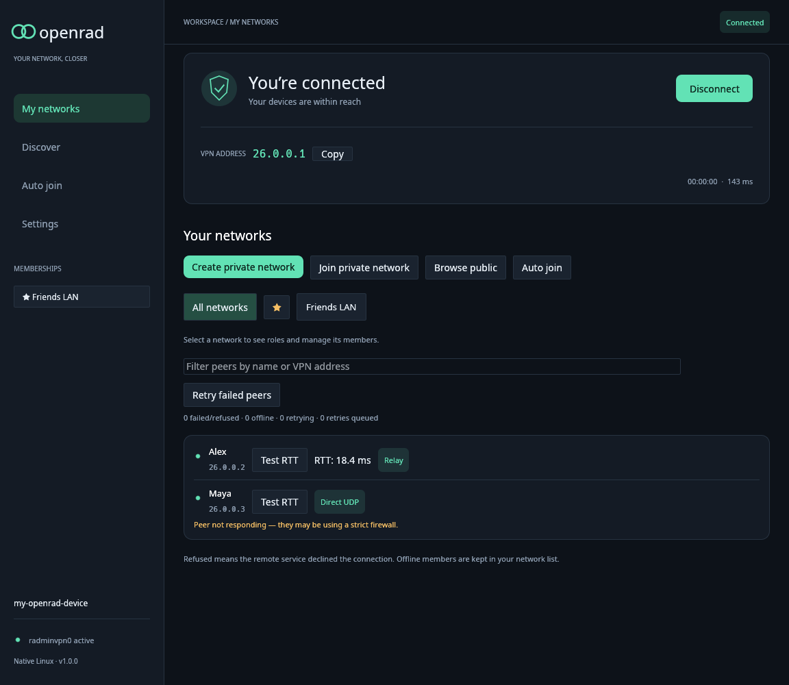
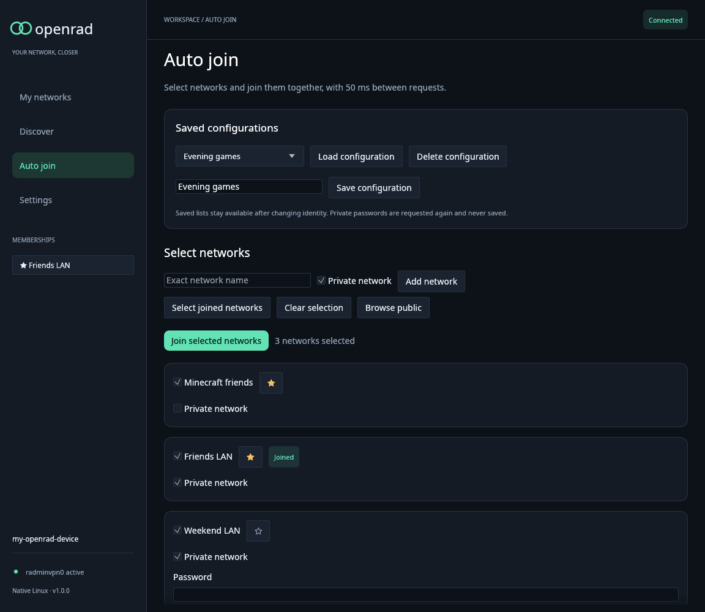

# Desktop and identities

Build the workspace and keep both binaries together. Start `openrad-desktop` from an ordinary user session with the credential store unlocked. The desktop's network operations run in a background engine so handshakes and packet forwarding do not block the interface.

Those privilege instructions apply to Linux. On Windows 10/11 x64, run `OpenRad-Setup.exe`: it installs the official signed TAP-Windows6 driver, creates a dedicated adapter, and opens the desktop. Repeat setup opens the existing installation; `--no-launch` skips desktop startup. Normal GUI launches request administrator approval automatically. Identities use Windows Credential Manager. Normal disconnect removes the VPN address/session routes while retaining the installed adapter. Windows support is experimental and the tester reports it working on Windows 10; the published binaries were cross-built on Linux, and other Windows configurations still need validation; follow [Windows setup and tests](windows.md).

Graphics startup defaults to `--renderer auto`: on Windows, native Direct3D 12
hardware, then the WARP CPU adapter, then OpenGL. This lets a VM without OpenGL
use the desktop and avoids entering an OpenGL translation layer when native
rendering is available. Use `--renderer software`, `--renderer opengl` or
`--renderer wgpu` to select a single path. On Linux the order remains OpenGL,
hardware WGPU, then a Vulkan CPU driver such as Mesa lavapipe.

Developers can check startup with `cargo run -p openrad-desktop --example
graphics-smoke -- --renderer software`. This briefly opens a synthetic window
and closes after three frames, without accessing profiles, credentials or the
VPN backend. An opt-in Linux pixel check is available with `cargo test -p
openrad-desktop --locked -- --ignored
cpu_renderer_draws_clipped_geometry_and_font_text_without_opengl`; it requires a
Vulkan CPU driver and renders offscreen without a window.

## Connection and network management



These 1.0.0 screenshots use synthetic data rendered on Linux.


The desktop and CLI attach to one per-user background service and share its live session, peers, networks, and interface. You can open either frontend first. Closing the desktop window leaves the VPN running; **Disconnect** or `openrad stop` stops it for both frontends. Keep `openrad` beside `openrad-desktop`, since the desktop starts that service through the sibling executable.

On first connection, OpenRad provisions a new identity and saves it to the OS credential store. Later connections reuse that identity. If the CLI already initialized this profile, the desktop uses its existing private identity file without registering another device. Both frontends resolve the same default profile: `$XDG_STATE_HOME/openrad` (usually `~/.local/state/openrad`) on Linux or `%LOCALAPPDATA%\openrad` on Windows. An existing desktop profile with saved settings is reused when the default CLI profile has not been initialized. Use the same `--data-dir PATH` for both binaries when selecting a custom profile. **Settings** offers:

- **Language:** automatic system-language selection, English, Português, Русский, or Tiếng Việt. The language changes immediately, including dialogs, notifications and retained activity. Use **Save preferences** to keep the selection after restart. **Discard changes** restores the saved language; **Restore defaults** selects the system language again. Existing profiles without a language preference use automatic selection.
- **Connection:** connect on launch, reconnect after failures, maximum retry attempts (1–10), and the initial retry delay (1–30 seconds). Later retries double the delay, capped at five minutes. The device name remains editable after registration. Saving a new name reconnects with the same identity and keeps the VPN address and network memberships. **Force Relay** uses only relay connections in both directions; saving it cancels existing channels and reconnects without direct TCP, UDP, or endpoint-discovery attempts.
- **Outgoing broadcasts:** enter a peer RID, exact name, or VPN IP and use **Apply broadcast target**. The setting is saved immediately and applies without reconnecting. **Send to all peers**, or applying `0.0.0.0`, restores normal broadcast distribution. Incoming broadcasts remain enabled from every authorized peer. If the selected target is unavailable, outgoing broadcasts are dropped. This also restricts ARP broadcasts, which can prevent address resolution of other peers. The same setting is available through [`openrad broadcast-peer`](cli.md).
- **Workspace:** the page shown at startup, interface scale, traffic overview and graphs, decimal or binary traffic units, visibility of offline peers, peer sorting, and the number of recent activity events shown.
- **Developer view:** inline peer connection details, internal IDs, and live session, interface, peer, and frame counters. **Copy diagnostic summary** copies aggregate counters without credentials or packet contents.

Workspace display changes preview immediately. Use **Save preferences** to keep them after restart, **Discard changes** to return to the last saved values, or **Restore defaults** to prepare the defaults for saving. The created identity's name is preserved when restoring defaults. Settings remain separate from credentials and are saved per profile.

The [outgoing broadcast controls](screenshots/1.2.0-broadcast-settings-pt.png) have
their own immediate apply/reset actions. Saving or discarding other preferences
does not overwrite the broadcast recipient selected from either frontend.

Automatic language selection uses the message locale (`LC_ALL`, then `LC_MESSAGES`, then `LANG`) and GNU `LANGUAGE` preference lists. `C`, `C.UTF-8`, and `POSIX` explicitly select English. Regional variants such as `pt_BR.UTF-8`, `pt-PT`, `ru_RU`, and `vi-VN` select the corresponding supported language; unsupported locales fall back to English. The detected language is shown beside the selector. The embedded Noto Sans font covers Cyrillic and Vietnamese accents without requiring fonts to be installed on the system.

`--language system|en|pt|ru|vi` overrides the language for that launch, including help and command-line errors. Language names in the selector use their own language so it is possible to switch back after selecting an unfamiliar one. Network/device names, addresses, paths and protocol identifiers keep their original values. JSON connection diagnostics use stable English messages; unrecognized details from external libraries or the operating system are preserved.

In **Your networks**, choose **Create private network** or **Join private network**. Enter the exact network name and password; creation also asks you to confirm the password. Passwords are masked by default and are not saved in your profile. **Browse public** opens the existing public-network catalog.

Select a network to see your role and each member's role. Administrators have a **Manage** menu beside each member with **Remove member**, **Grant admin**, or **Revoke admin**. Each change shows a confirmation naming the member and network. The menu works for offline members too, and is disabled while a command is running. Role changes and removals reported by the service update the view.

**Leave network** removes your own membership. The service may prevent the last administrator from leaving: grant admin to another member first, or use **Delete network**. Deletion requires confirmation and removes the network for everyone. Removing a member is not a permanent ban; someone who still knows the password may rejoin.

Server refusals and password failures appear in the notification and Recent activity. If an operation times out, reconnect to load the service's current membership before retrying. A network that requires administrator approval is shown as **Pending approval** and is excluded from forwarding until approved.

Public-network results filter as you type. Server searches start after a 300 ms pause, including an initial browse when opening **Discover**. The field stays editable during requests, and replies for older queries are discarded. **Load more networks** still pages through the current query.

Use the **☆** button beside a public or joined network to add it to your
favorites; **★** removes it. Favorites appear first in public results, joined
network selectors, and the sidebar. When several favorites are visible, they
are ordered by member count, highest first, with names breaking ties. Public
results use the server's reported count; joined networks use their current
membership roster. Favorites are saved immediately per profile and survive
restarts, leaving a network, and identity replacement. Search filters still
apply to favorites.

The sidebar lists all joined networks in a scrollable area while the device
name, interface status, and version stay at the bottom. Drag its right edge to
resize it; the width is kept while the desktop stays open and adjusts to fit
smaller windows. The network selector above the peer list scrolls horizontally
when its buttons do not fit. Long network names are shortened to fit their
buttons; hover to see the full name.

**Auto join** lets you select multiple public and private networks and click
**Join selected networks**. Select public results with **Select for auto join**,
select a joined network from its detail view, use **Select joined networks**, or
add an exact network name on the Auto join page. Mark networks that need a
password as **Private network** and enter their passwords. Networks joined
outside this desktop may need their access type adjusted before saving a list.
All required passwords are checked before any requests are sent. Already
joined networks are skipped, including memberships pending approval. Joins
overlap, starting at least 50 ms apart instead of waiting for previous joins to
finish. Each row reports success, pending approval, or failure independently.
One refusal does not cancel the other joins. Disconnecting, changing identity,
or closing the desktop stops requests that have not yet been submitted; requests
already sent can still take effect on the server. A timed-out membership change
still requires reconnection to reload the server's current state.



Enter a **Configuration name** and choose **Save configuration** to save the
selection. Saving with an existing name updates that configuration. Choose a
saved list and click **Load configuration** to restore it after restarting or
changing identity, then enter any required private passwords and join. Loading
a configuration replaces the current selection. **Delete configuration**
removes the saved list. Up to 32 configurations of 128 networks each are
supported. Names, access types, and favorites are stored separately from device
credentials and display settings in `network-preferences.json`; passwords
remain in zeroized memory and are never saved with a configuration. Loading a
list or changing identity clears entered passwords. No joins run automatically
on launch or when loading a list: the Join button starts the batch.

Concurrent private joins use the existing request ID or authentication sequence
to route each server password reply. Legacy replies that omit both fields remain
supported for one private join at a time. If multiple private joins make an
uncorrelated reply ambiguous, OpenRad ends the session before applying the
password proof. Reconnect and join those private networks individually.

Each connected peer has a **Test RTT** button. It measures the round trip of a correlated, authenticated tunnel keepalive and displays milliseconds beside the peer. After 3000 ms without a matching reply, the row shows “Peer not responding — they may be using a strict firewall.” Results remain until the next test or session change. This measures the active peer transport and does not require ICMP privileges or a TAP interface.

The desktop checks GitHub’s latest published release at launch and hourly, compares semantic versions, and shows a release link when a newer stable version is available. The notice remains through navigation, session changes, and failed checks; only its **×** button dismisses it. The same version stays dismissed for the rest of that launch. Checks use the system `curl` HTTPS client (included in current Windows installations); install `curl` on Linux if needed. Requests have a 15-second limit and never block the UI.

The peer table distinguishes Direct TCP, Direct UDP, and Relay. These labels represent authenticated peer channels. They are separate from the overall service connection status. Incoming channels and outgoing channels use the same authentication and Ethernet forwarding checks.

Transient peer failures and refused connections retry automatically: 1.5–4.5 seconds
after the first failure, 3–9 after the second, 6–18 after the third, then
12–36 seconds. Recovery runs alongside initial setup and prioritizes peers that
were previously connected. Depending on the recovery demand, it allows 16, 32,
or 48 outgoing retries in progress, with 200, 100, or 50 milliseconds between
starts. If at least three quarters of eight or more recent retries fail, the
limit falls to at most 32 and starts are spaced by at least 150 milliseconds.
Due retries reserve outgoing setup slots while new peers are also connecting.
**Retry** uses the same adaptive queue, retaining failure history and already
queued earlier deadlines.
The network page shows failed/refused, offline, active retry, and queued retry
counts so recovery can be monitored separately from the total roster.
Incoming offers can bypass the wait to preserve their rendezvous window.
Roster-only members without a server endpoint are
not scheduled for connections. Both online presence states preserve established
channels; offline, address/server changes, and revoked membership still cancel
the affected connection.

Public-network search timeouts and a full command queue report an operation
error while keeping the connection running. A timed-out membership mutation
still requires reconnection to resolve its uncertain outcome.

The Linux desktop uses a `26.0.0.0/8` virtual LAN and group routes for broadcast and multicast. Disconnecting closes the TAP descriptor and removes the temporary interface and its routes.

IPv4 broadcast, multicast, and gratuitous ARP requests/replies are forwarded to
eligible authenticated peers. The TAP can be ready before peer handshakes finish,
so OpenRad sends a broadcast gratuitous ARP reply announcing its TAP IP/MAC to each
newly authenticated channel. Recreating the TAP announces it to existing channels
as well. These 42-byte frames use the TAP's current MAC, which can differ from the
old Wine adapter's MAC. Forwarded frames retain their original bytes. Gratuitous
ARP replies do not require matching VPN IP/MAC addresses; other source validation
and membership restrictions still apply. The outgoing broadcast preference also
controls these announcements.

## Diagnosing connection drops

The desktop automatically records connection diagnostics in the profile's
`diagnostics` directory. **Settings → Copy connection log path** copies its exact
location, including for profiles selected with `--data-dir`. On a standard Linux
profile this is normally `~/.local/state/openrad/diagnostics` (or the retained desktop profile’s directory).

The current log is `connection.jsonl`. Three older files, `connection.1.jsonl`
through `connection.3.jsonl`, retain earlier events, with `.1` the most recent
archive. Each file is limited to 4 MiB, for at most 16 MiB total. Logging uses a
bounded background queue so disk writes cannot hold up network heartbeats. Log
queue overflows and write failures are counted in subsequent records. A log-open
failure is shown in Recent activity; a later write failure is also printed to
the launch terminal.

Each JSON line has a wall-clock timestamp in milliseconds, process uptime,
process ID, session number, event name, and `details`. Session numbers distinguish
automatic reconnects within one process. Events include:

- `session_end` and `session_reconnect`: the full error chain, uptime, number of
  connected peers at shutdown, and whether another session is scheduled.
- `control_closed` and `server_disconnect`: the last service operation, last
  receive age, heartbeat count, and any explicit disconnect reason code. Unknown
  disconnect fields are described by tag and size without recording their data.
- `peer_connecting`, `peer_transport_attempts`, `peer_connected`, and `peer_closed`:
  peer/attempt IDs, candidate transport results, selected endpoint, channel
  lifetime, last receive age, keepalive counts, and the error that closed it.
- `peer_cancelled` and `membership_updated`: distinguish roster/binding changes
  from transport failures. `peer_retry_scheduled` records individual retry delays.
- `peer_address_announcement`: records whether the local gratuitous ARP was queued
  for an authenticated peer; the frame itself is not logged.
- `session_health` and `control_health`, every 30 seconds: roster, eligible and
  connected counts, handshakes, traffic/drop counters, engine delays, and control
  heartbeat timing. `peer_drop_burst` flags a fall of more than half the connected
  peers between UI snapshots, starting from at least ten connected peers.
- `control_event_backpressure`, `control_event_queue_recovered`, and
  `control_heartbeat_delayed`: identify scheduling or queue pressure.

After another mass disconnect, preserve all four available log files and note
the approximate time and network. The logs include peer IDs and endpoint
addresses, but exclude reusable identities, passwords, session keys, and packet
contents. Files are created with owner-only permissions on Unix. Recent activity
also includes the peer failure detail instead of only the status label.

## Reset identity

The **Reset identity** action opens a confirmation dialog explaining that the device identity and network memberships will change. Confirming it:

1. Cancels queued connection work, disconnects the running session and closes the TAP interface. Stop requests are retried for up to 10 seconds.
2. Provisions a replacement through the normal registration flow. Connection and handshake failures before registration receive up to three attempts per server, with one- and two-second retry delays and a 90-second aggregate network budget.
3. Saves the new identity in the credential store only after provisioning succeeds, retrying a failed save up to three times.
4. Updates the active identity only after the credential-store write succeeds.

If provisioning fails, the existing saved identity remains intact. If provisioning succeeds but the credential store cannot save it, the replacement remains in memory for a storage retry; retrying does not provision another identity. Keep the window open until the credential store is unlocked and the save succeeds. The confirmation UI and close handling warn about an unsaved replacement.

Progress and **Recent activity** show the current server, attempt number, retry delay, registration, and save stages. A failed reset leaves the busy phase and displays its error; status from the previous session cannot hide it behind “Connecting”. Reset finishes disconnected. Use **Connect** to start a session with the saved replacement.

Registration is not retried automatically once its login may have reached the server. A missing response can mean the server issued a device identity that OpenRad did not receive; the error explains this uncertainty. Authentication or protocol rejection also fails immediately instead of repeating the request.

**Settings → Copy identity reset log path** copies the desktop diagnostic file, normally `~/.local/share/OpenRad/logs/desktop-startup.log` on Linux or `%LOCALAPPDATA%\OpenRad\logs\desktop-startup.log` on Windows. `OPENRAD_LOG_DIR` (or the desktop-only `OPENRAD_DESKTOP_LOG_DIR`) overrides the directory. These JSON records include elapsed times, servers, redirects, attempts, full error chains, and whether a replacement still needs saving. They exclude passwords, issued credentials, session keys, and packet contents. Keep this file alongside the connection logs when reporting a reset failure.

New identities do not inherit the previous identity's memberships. Resetting is not a way to recover access to a lost identity.

## Profiles and imports

The default profile directory comes from the platform's application-data location. `--data-dir PATH` selects an independent profile. The canonical profile path identifies the corresponding credential-store entry, so moving a profile directory does not automatically move its saved identity.

```sh
./target/release/openrad-desktop --data-dir ./profiles/alternate
```

`--identity FILE` imports a saved CLI identity into that profile's credential store. An import cannot overwrite a different identity already saved in the same profile. Identity files contain reusable credentials; store them outside source control and delete redundant copies only after verifying the import.

Settings are written separately from credentials. A profile lock prevents two desktop instances from using the same profile concurrently. Do not run two clients with the same identity at the same time.

For controlled traffic checks, `--traffic-peer RID` can be repeated to limit desktop application traffic to selected peers. Ordinary desktop mode allows traffic to eligible joined-network members.
