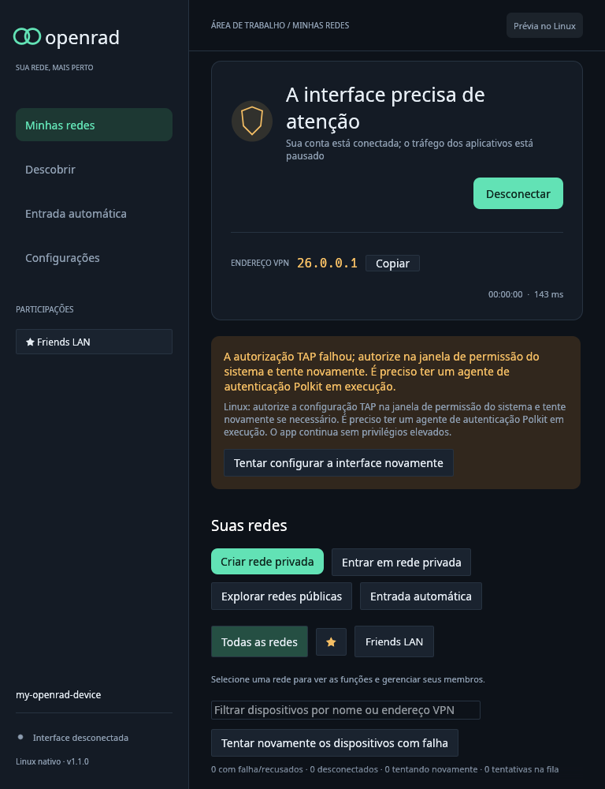

# OpenRad 1.1.0 — Linux TAP authorization and service security

OpenRad 1.1.0 fixes Linux interface setup when the shared VPN service cannot reuse
the launching terminal's sudo authorization. Connecting now requests permission
through the desktop session's Polkit agent after trying existing noninteractive
sudo authorization. Only the short-lived TAP helper is elevated. Interface setup
runs in a worker so the service can continue handling status, stop, and peer
forwarding while the system permission dialog is open.

This release includes all security and identity-preservation changes since
v1.0.0. Read the [changelog](../../CHANGELOG.md#110--2026-10-02) and
[complete file inventory](1.1.0-changes.md). Windows support remains experimental.

## Downloads and upgrade

- `openrad-v1.1.0-linux-x86_64.tar.gz`: CLI and desktop, guides, synthetic
  screenshots, dependency/standard-library notices, build/library metadata,
  full changelog/inventory, and internal checksums. Requires glibc 2.35+.
- `OpenRad-Setup-1.1.0.exe`: offline Windows installer, all three executables,
  pinned signed TAP-Windows6 9.27.0 driver, corresponding driver source,
  installer source, guides, notices, and audited installation manifest.
- `openrad-1.1.0-windows-x86_64-setup.zip`: installer plus documentation,
  validation, build/import/driver metadata, screenshots, and checksums.
- `openrad-1.1.0-windows-x86_64-test.zip`: portable Windows executables,
  launch/diagnostic tools, guides, metadata, and notices. Requires an already
  installed dedicated TAP adapter and elevation.
- `SHA256SUMS`: SHA-256 checksums for all four distribution files.

Stop the old service with **Disconnect** or `openrad stop`, close the desktop,
then replace both Linux binaries together or run the Windows installer. The
running service retains its old executable until explicitly restarted. Existing
identities, network memberships, favorites, and saved join lists are retained.
Closing either frontend continues to leave the shared VPN running.

On Linux, start `./openrad-desktop` as your normal user, connect, and allow the
system permission dialog. Install Polkit/pkexec and start a session authentication
agent if your desktop does not provide one. A `sudo -v` password accepted in a
terminal cannot reliably authorize a detached service with terminal-bound sudo
timestamps. If authorization is refused or cancelled, retry interface setup.
Headless systems without an agent need administrator-managed helper
authorization; see [Linux setup](../linux.md#tap-permissions). OpenRad never
collects the administrator password. Dialogs are bounded to 120 seconds and
subsequent setup to 15 seconds; Disconnect/Stop cancels pending Linux setup.

## Additional changes

- Bound the local service to 32 active client workers and 128 queued commands,
  enforce aggregate read/write deadlines and outgoing request sizes, and retain
  Windows named-pipe instance capacity under load.
- Use protected OS paths for curl and elevated PowerShell. Reset PowerShell
  module lookup to system modules, embed the adapter setup script, and validate
  interpolated adapter/driver identifiers.
- Reject remote peer loopback candidates, including IPv4-mapped IPv6 bypasses,
  while retaining private LAN routes and explicitly local control deployments.
- Sanitize terminal control characters in remote display names, retain Unicode
  and truncated-emoji tolerance, and reject controls in strict protocol text.
- Bound regular-file reads for identities, passwords, settings, moduli, and
  installation records. Reject FIFOs immediately and preserve corrupt/broken
  preferences for repair.
- Keep passwords and serialized local requests in zeroized memory. Clear
  overlapped Windows buffers after completion or cancellation ends kernel use.
- Refuse automatic device registration when an existing credential-store
  identity cannot be ruled out because the store is unavailable or locked.
  Preserve incomplete private profiles and broken identity paths on their
  original storage backend; explicit private-file imports remain supported.

The screenshot contains synthetic networks, peers, addresses, and identity.

## Build provenance and verification

Linux distribution binaries are freshly compiled from the release source in the
established Debian 12 / Rust 1.95.0 builder. Windows GNU binaries are freshly
cross-compiled with Rust 1.98.1 and MinGW-w64. Archive metadata records the source
commit/tree and actual toolchains. Packaging audits architecture, binary
versions, ELF/PE dependencies, notices, pinned driver/source hashes, installer
manifest, extracted payload hashes, and internal/external checksums.

- **279 default Linux workspace tests passed**, with six intentionally ignored
  optional tests. These tests remain headless and unprivileged.
- **Four optional offscreen rendering tests passed** with the Vulkan CPU driver.
  The new Portuguese authorization screenshot was inspected at 768 pixels wide;
  it shows the complete guidance and retry action without clipping.
- **Formatting and Clippy passed for Linux and Windows GNU**, with warnings
  denied. All Windows test executables compiled; cross-compilation does not
  execute them. Both platform release builds completed.
- **Eleven mocked PowerShell adapter-setup cases and 19 recovery cases passed**,
  including script syntax. No real Windows cmdlets or drivers were used.
- **Eight isolated Wine 11.11 installer-flow cases passed** with dummy programs.
  Initial validation on a heavily loaded host timed out during Wine startup;
  the successful retry used 180-second process budgets instead of 60 seconds.
- **Two selected Windows tests passed under isolated Wine**: trusted elevated
  PowerShell command construction and transformed overlapped-write storage,
  including rejected transforms. The remaining Windows tests were compiled,
  but not run in this release. Wine is not native Windows validation.
- Linux CLI/desktop and Windows CLI/desktop/setup-worker executables report
  **1.1.0**. Publication requires package architecture/import/license audits,
  exact extracted-installer payload checks, and internal/final SHA-256
  verification to pass.

## Platform limits

The new sudo/Polkit fallback, startup marker, descriptor ownership, authorization
refusal, timeout, and cancellation are tested with synthetic unprivileged local
children. No real VPN or user's active service is stopped during validation.
The privileged Linux TAP/Polkit session path requires a native desktop session
and administrator approval and is not asserted as tested by synthetic checks.

Cross-compilation, mocked PowerShell cmdlets, isolated Wine installer tests,
and offscreen Linux screenshots do not establish native Windows TAP, UAC,
credential-store, named-pipe security, Direct3D, or real Radmin interoperability.
Native Windows validation remains outstanding. Applications are unsigned; the
TAP driver is the upstream unchanged signed package.
