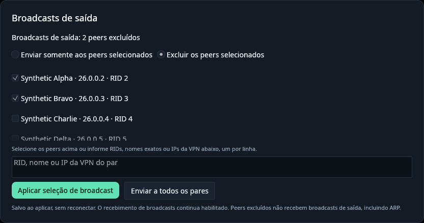

# OpenRad 1.4.0 — Multiple broadcast recipients and exclusions

OpenRad 1.4.0 lets the CLI and desktop select several peers to receive outgoing
broadcasts, or exclude selected peers from normal broadcast distribution. Both
frontends share the saved selection through the existing service; changes apply
without reconnecting. Existing single-peer preferences remain supported.

This release includes every changed and added file since freshly fetched
`origin/main` at `48c60b3a4b61d731c114490d78b8872c14f95556` (v1.3.0).
Both platforms are rebuilt from the same committed 1.4.0 source. Read the
[changelog](../../CHANGELOG.md#140--2026-10-04) and
[complete file inventory](1.4.0-changes.md). Windows remains experimental.

## Downloads and upgrade

- `openrad-v1.4.0-linux-x86_64.tar.gz`: CLI and desktop, English and Brazilian
  Portuguese guides, synthetic screenshots, dependency/standard-library notices,
  build/library metadata, release history and internal checksums.
- `OpenRad-Setup-1.4.0.exe`: offline Windows installer with all three
  executables, pinned signed TAP-Windows6 9.27.0 driver, corresponding driver
  source, installer source, guides, notices and audited installation manifest.
- `openrad-1.4.0-windows-x86_64-setup.zip`: installer plus documentation,
  validation, build/import/driver metadata, screenshots and checksums.
- `openrad-1.4.0-windows-x86_64-test.zip`: portable Windows CLI and desktop,
  launch/diagnostic tools, guides, metadata and notices. Requires an already
  installed dedicated TAP adapter and elevation.
- `SHA256SUMS`: SHA-256 checksums for all four distribution files.

Run `openrad stop` and close the desktop before replacing binaries or running
the Windows installer. Keep the CLI and desktop from the same release together.
Closing a frontend leaves the shared service running; stopping it ensures the
next start loads the new engine. Existing identities, memberships, favorites,
join configurations and credential storage are retained. No identity reset or
new device registration is required.

Both Cargo package versions, the lockfile and all fresh executables report
1.4.0. Linux binaries use the established Debian 12 / Rust 1.95.0 builder;
Windows x64 binaries are cross-built with Rust 1.98.1 / MinGW-w64. Package
metadata records actual compilers, committed source and builder provenance.
The Linux CLI requires glibc 2.34 or newer and the desktop requires glibc 2.35
or newer, plus the libraries in the [Linux guide](../linux.md).

## Broadcast selection

In **Settings → Outgoing broadcasts**, check several peers, choose inclusion
or exclusion, and apply the selection. The virtualized list supports large
rosters and removing saved peers while offline. Optional text targets accept
one RID, exact name or VPN IP per line. The CLI accepts multiple targets:

```sh
openrad broadcast-peer 123456789 987654321
openrad broadcast-peer --exclude 123456789 987654321
openrad broadcast-peer --all
```

`broadcast-peers` is also accepted as a command alias. A command without targets
reports the current selection. Inclusion sends to the eligible selected peers;
exclusion removes the selected peers from normal distribution. Restoring all
recipients also accepts the existing `0.0.0.0` sentinel. Invalid, ambiguous or
self targets reject the entire update before persistence. Selections are
deduplicated and bounded to 1024 peers.

Incoming broadcast handling, unicast and multicast routing retain their existing
behavior. Directed ARP keeps normal IP-target routing in exclusion mode;
inclusion retains the existing selected-recipient behavior. An unavailable
included peer does not redirect traffic to another peer. See the
[CLI guide](../cli.md#outgoing-broadcast-recipient) and
[Portuguese reference](../cli-pt-BR.md) for examples and eligibility rules.



The screenshot is rendered on Linux with synthetic names, addresses and peers.
Controls and errors are translated into English, Portuguese, Russian and Vietnamese.

## Performance and validation

Recipient indexes are compiled when policy or channel eligibility changes.
Frame forwarding iterates only the effective destination list, without policy
locks, per-packet RID lookups or scans through the exclusion set. Queued work
retains its destination snapshot, shared frame buffer, FIFO order and existing
cancellation and capacity bounds. Generated announcements use the same policy.

Nine alternating pinned-CPU synthetic benchmark runs measured 5,000 broadcasts
to 120 peers at 18.59 ms before and 18.69 ms after, within observed variation.
Selecting one peer measured 0.53 ms; selecting 60 peers measured 9.44 ms and
excluding 60 measured 9.46 ms. The separate directed-frame case measured
5.16 ms before and 5.45 ms after for 50,000 frames. These measure local routing
and queue draining, excluding dispatcher handoff, encryption, TAP and network
I/O. Live throughput and latency were not measured. Full methodology and
limitations are in the [performance guide](../performance.md).

Implementation validation completed before release preparation:

- **303 default Linux workspace tests passed**, with eight optional tests
  ignored. Regressions cover inclusion/exclusion, ARP, admission, shared
  buffers, snapshot/FIFO behavior, legacy settings, atomic persistence and
  stopped/live service commands.
- **Formatting and Linux/Windows GNU Clippy passed**, with warnings denied.
  Every Windows workspace test executable compiled.
- The optional CPU-rendered settings test passed. Eight screenshots covering
  four languages and narrow/wide layouts were inspected, including actual
  checkbox and mode-selection interactions.

These implementation checks are reused for this release and were not rerun for
version and release-document changes. Release checks verify freshly compiled
executable versions, ELF/PE architecture and imports, dependency and standard-
library notices, pinned driver/source hashes, every extracted installer payload
file, packaged documentation links and internal/external SHA-256 checksums.
Build metadata identifies the committed source and clean worktree.

No real VPN or active user service is stopped during build/package validation.
Cross-compilation, synthetic rendering and Wine version checks do not establish
native Windows TAP, UAC, credential-store, named-pipe ACL, Direct3D or real
Radmin interoperability. Native Windows validation remains outstanding.
Applications are unsigned; the TAP driver is the unchanged upstream signed
package. The previous connection and Windows recovery changes are retained;
see the [1.3.0 guide](1.3.0.md) and [1.2.0 refresh](1.2.0-windows-refresh.md).
